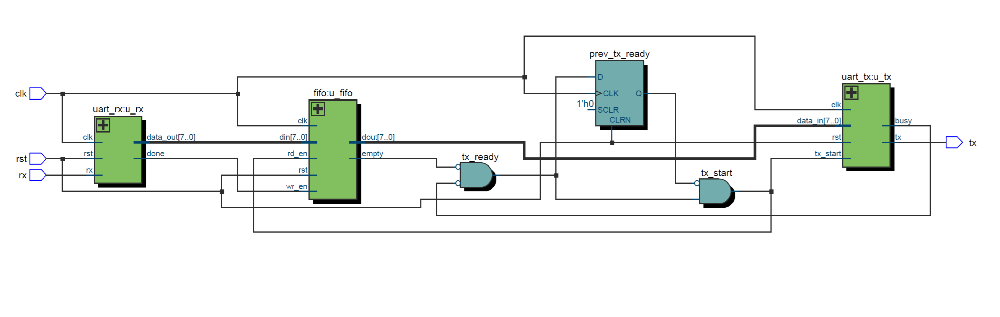

# UART FIFO Verilog Project

This project implements a UART (Universal Asynchronous Receiver/Transmitter) module with integrated FIFO buffers using Verilog HDL. The design includes transmit (TX) and receive (RX) modules, plus a top-level controller to manage data flow and synchronization.

---

## 📁 Project Structure

| File | Description |
|------|-------------|
| `uart_rx.v` | UART receiver: detects start bit, samples incoming bits, and outputs 8-bit data |
| `uart_tx.v` | UART transmitter: outputs start, data, and stop bits from input data |
| `fifo.v` | Parameterized synchronous FIFO used to buffer RX to TX |
| `uart_fifo_ctrl.v` | Top-level controller linking RX → FIFO → TX |
| `tb_uart_fifo.v` | Testbench for ModelSim simulation |
| `RTL_uart_fifo_ctrl.png` | RTL block diagram (embedded below) |
| `wave_tb_uart_fifo.png` | ModelSim waveform screenshot showing correct behavior |

---

## 🧠 RTL Architecture

---

## 📈 Simulation Result

The testbench sends 1 byte (`0xA5 = 8'b10100101`) through the `rx` pin using UART format (start + data + stop). The data is received, pushed into the FIFO, and correctly sent out via the `tx` pin.

---

## 🛠️ Tools Used

- **ModelSim / Questa** – simulation and waveform verification
- **Quartus Prime Lite (Cyclone V)** – RTL compilation and block diagram generation
- **GitHub** – version control and sharing

---

## ▶️ How to Use

1. Clone or download this repository
2. Open files in your Verilog-compatible toolchain
3. Simulate `tb_uart_fifo.v` in ModelSim
4. Synthesize using `uart_fifo_ctrl.v` as top-level module
